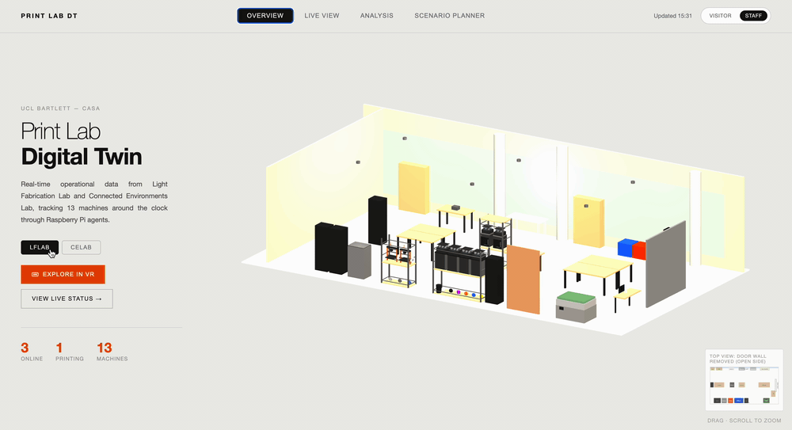
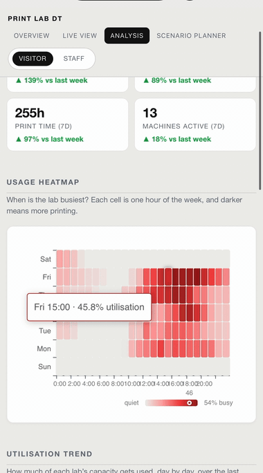
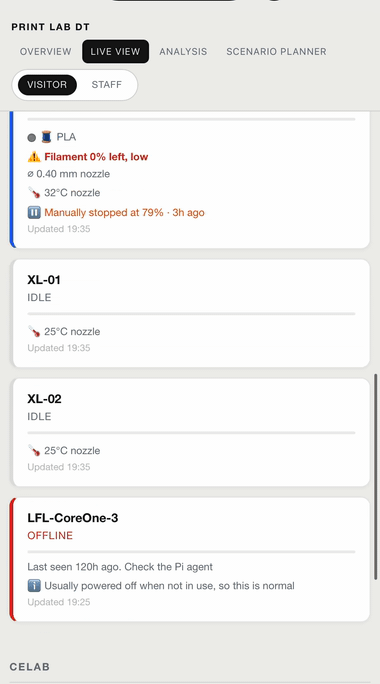
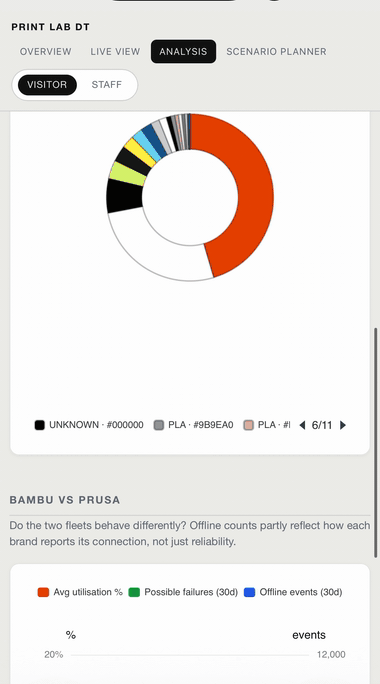
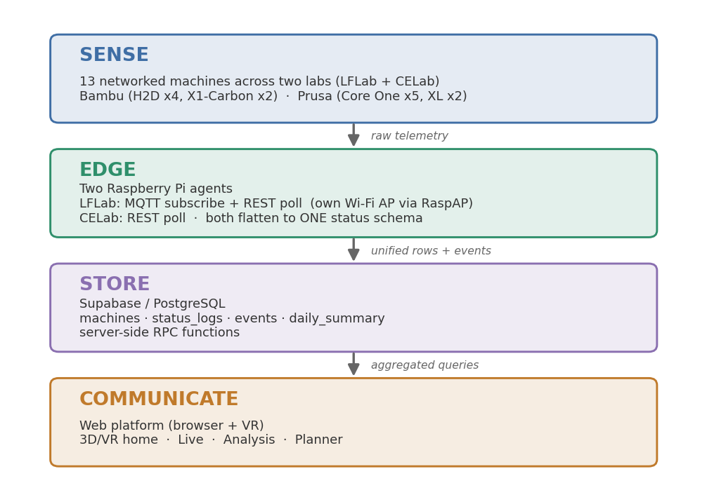
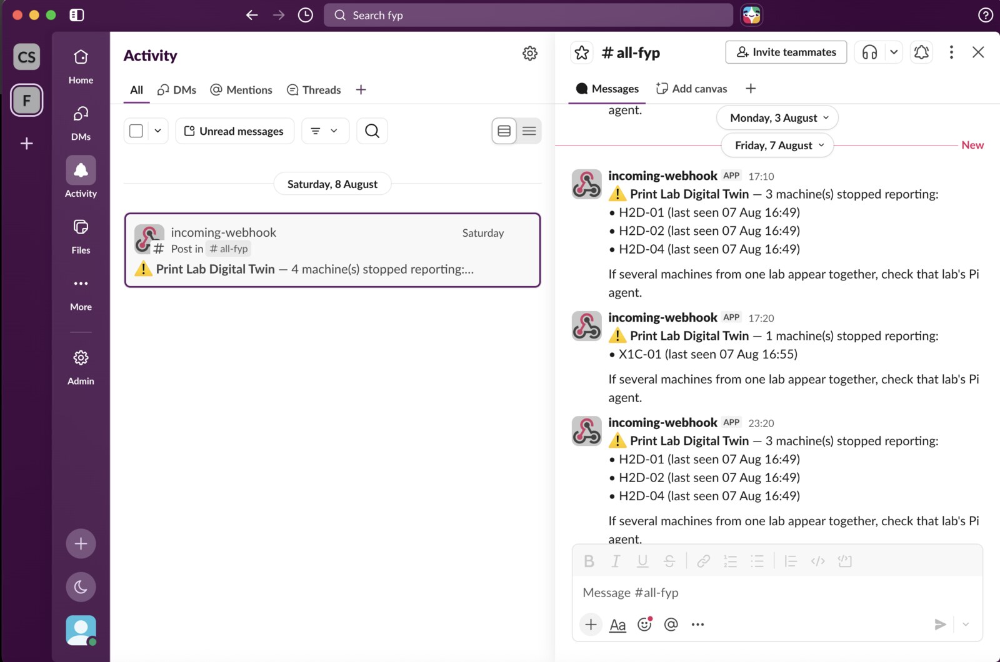
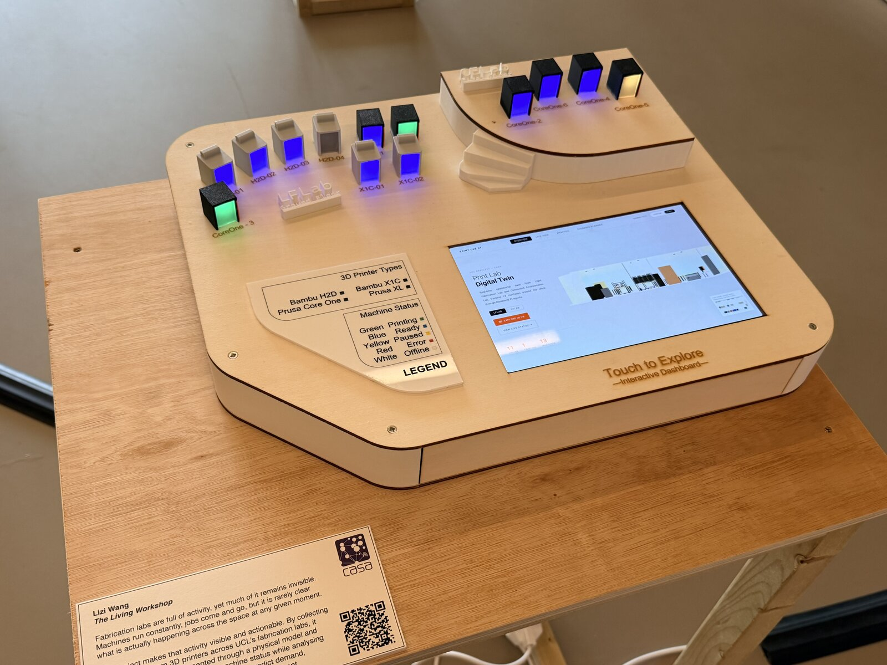

<h1 align="center">Print Lab Digital Twin</h1>
<p align="center"><b>An operational digital twin for a multi-vendor 3D-printing workshop.</b><br>
Two labs, two printer brands, two protocols &rarr; one live, trustworthy view.</p>

<p align="center">
  <a href="https://0022-fyp.vercel.app/"></a>
  
  
</p>

<p align="center">
  
</p>
<p align="center"><i>The live platform &mdash; an isometric overview of 13 printers across two labs. <a href="https://0022-fyp.vercel.app/">Open it &rarr;</a></i></p>

---

## What is this?

A workshop full of 3D printers is easy to *look* at and hard to *know*. Different machines speak different languages, sit on different networks, and report in different ways, so nobody can answer simple questions: which machines are free, which are stuck, how busy is the lab really?

This project connects a fleet of **13 printers across two labs and two vendors** into a single real-time platform. Bambu machines push telemetry over MQTT; Prusa machines are polled over a REST API. Both are flattened into one schema, stored in Postgres, and surfaced through a live web app you can open on any phone.

But the real point sits one level deeper &darr;

## The core finding

> **Integration is necessary but not sufficient.** Getting every vendor into one clean format makes the data *look* trustworthy &mdash; the dashboard is green, the numbers line up &mdash; while validity failures stay completely invisible at the visualisation layer.

The clearest example: a raw job count that was inflated **20&ndash;40&times;** by a reconnection bug in one lab's agent, yet rendered as a perfectly plausible chart. The dashboard could not have told you anything was wrong. This project traces where that trust breaks, and rebuilds the counts from the events that *are* reliable. That data-validity story is the heart of the [dissertation](#dissertation--author) &mdash; the printers are just a clean test case for a general multi-vendor integration problem.

---

## ✨ The platform

**[&rarr; Open the live app](https://0022-fyp.vercel.app/)** &nbsp;·&nbsp; installable PWA &nbsp;·&nbsp; works offline on last-known data

Four views, each answering one question, with a **Visitor / Staff** toggle that hides the deep operational panels from casual viewers. The **Overview** (hero above) maps both labs in an isometric 3D scene you can also step into in **VR**.

**📊 Analysis — the data view**

<p align="center"></p>
<p align="center"><i>Utilisation heatmaps and trends, filament mix, a Bambu-vs-Prusa reliability comparison, leaderboards and per-machine health scores.</i></p>

**On the floor — Live status & planning**

<table>
  <tr>
    <td width="50%" valign="top" align="center">
      <br>
      <b>🟢 Live</b><br>
      <sub>Every machine's current state, progress, temps and filament — updating in real time. Tap a machine for its full card.</sub>
    </td>
    <td width="50%" valign="top" align="center">
      <br>
      <b>🗓️ Planner</b><br>
      <sub>Best time to visit, a "guess who's free next" game, average wait times, and a capacity simulator for adding machines.</sub>
    </td>
  </tr>
</table>

More detail: [`dashboard/README.md`](dashboard).

---

## 🏗️ How it works

Four layers turn a printer's blinking light into a number you can trust.

<p align="center"></p>

**1 · Edge acquisition — meeting each vendor on its own terms.**
A Raspberry Pi in each lab runs a small Python agent. On the LFLab Pi (also a Wi-Fi access point via RaspAP), the agent subscribes to **Bambu machines over MQTT** (they push updates). On the CELab Pi, the agent **polls Prusa machines over the PrusaLink REST API** (they answer when asked). Each agent normalises the vendor's message into one common status shape and infers events (`print_started`, `print_completed`, failures) from the stream.

**2 · Database — one schema for everything.**
Everything lands in **Supabase (Postgres)** across six tables: `machines`, `machine_status_logs` (the firehose &mdash; 1.68M+ rows), `machine_events`, `machine_daily_summary`, plus `alert_config` / `alert_log`. Row-Level Security means the public web app reads through an anon key that can *only* read.

**3 · Query layer — cheap, honest reads.**
Instead of hammering the raw log, the front end calls Postgres **RPC functions**: `latest_status_per_machine` (one row per machine), `usage_by_weekday_hour` (the heatmap), and a job-count function rebuilt to count **reliable terminal events** rather than the buggy raw starts.

**4 · Front end — the platform above.**
A dependency-free PWA (vanilla JS + Supabase client) renders the four views, caches last-known data in a service worker, and installs to a phone home screen.

> **Keeping the data honest.** A `pg_cron` job (`notify_stale_agents`, every 10 min) watches the pipeline itself and Slack-alerts the team when a machine stops reporting — because a dead Pi leaves the dashboard showing *stale* data that still looks perfectly green. Catching that kind of invisible failure is the whole point ([core finding](#the-core-finding)).
>
> 

More detail: [`deploy/README.md`](deploy).

### Multi-vendor integration, at a glance

| | **LFLab** | **CELab** |
|---|---|---|
| Printers | Bambu (X1C, H2D) + Prusa | Prusa Core One |
| Protocol | **MQTT** (push) | **PrusaLink REST** (poll) |
| Edge agent | `deploy/pi-LFlab/lfl_agent.py` | `deploy/pi-CElab/prusa_mqtt_agent.py` |
| Network | Pi as RaspAP access point | Pi on lab network |

Same job, two completely different data paths &mdash; which is exactly why they make a good stress test for the integration problem.

---

## 🛠️ The physical build

To make the twin tangible, the platform also lives inside a physical exhibition console: a laser-cut body with the tablet embedded in the middle running the live dashboard, ringed by 3D-printed printer miniatures whose LEDs mirror each real machine's status.

<p align="center"></p>

Full write-up, fabrication files and the LED playback code are in [`exhibit/`](exhibit).

---

## 🚀 Run it yourself

There are three levels, depending on how deep you want to go.

**1 · Just look.** Open **[0022-fyp.vercel.app](https://0022-fyp.vercel.app/)** — the live platform, reading real data from both labs. Nothing to install.

**2 · Run the web app yourself.** It is a static site (no build step, no environment variables). The public **read-only** Supabase URL + anon key are already committed in `dashboard/js/supabase.js` — that is safe to share, because Row-Level Security makes that key read-only — so a clone shows the real data immediately:

```bash
git clone https://github.com/Lizzim24/0022-fyp.git
cd 0022-fyp/dashboard
python3 -m http.server 8000      # then open http://localhost:8000
```

To host your own copy, point **Vercel / Netlify / GitHub Pages** at the `dashboard/` folder as the site root — no configuration needed.

**3 · Rebuild the whole system from scratch.** This is the full operational twin, and it needs **hardware**: a Raspberry Pi per lab plus the printers themselves. The code and schema are all here so it can be rebuilt or adapted:

1. Create a Supabase project and run `deploy/supabase/schema.sql` (tables, materialised views, RPCs, RLS, cron jobs).
2. On each Pi, `cp config.example.py config.py`, fill in the printer IPs / access codes and your Supabase keys, and run the matching agent (`deploy/pi-LFlab/` or `deploy/pi-CElab/`) as a `systemd` service.
3. Point `dashboard/js/supabase.js` at your own project URL + anon key.

> Only the secrets stay out of the repo: `config.py` (printer credentials, database password) and any `service_role` key are `.gitignore`d, and the Slack webhook lives in the `alert_config` table — never in git.

Per-layer details: [`dashboard/README.md`](dashboard) · [`deploy/README.md`](deploy) · [`exhibit/README.md`](exhibit).

---

## 📁 Repository structure

```
0022-fyp/
├── dashboard/          # Frontend PWA — the live platform
│   ├── index.html
│   ├── js/             # live.js · analysis.js · planner.js · supabase.js
│   ├── img/ · icons/
│   ├── style.css · manifest.json · service-worker.js
│   └── README.md
├── deploy/             # Edge acquisition + database
│   ├── pi-LFlab/       # Bambu MQTT agent (lfl_agent.py) + daily_summary.py
│   ├── pi-CElab/       # Prusa REST agent (prusa_mqtt_agent.py) + systemd service
│   ├── supabase/       # schema.sql
│   └── README.md
├── exhibit/            # The physical digital twin
│   ├── design/         # 3D-print + laser-cut fabrication files
│   ├── led-playback/   # Arduino LED playback (baked from Supabase history)
│   ├── media/          # build + finished photos
│   └── README.md
├── media/              # shared images/GIFs (platform views, architecture, alerts)
├── scripts/            # helper scripts (e.g. prusa_full_data.py)
├── web/data/           # snapshot.json — offline fallback
└── meetinglog/         # supervision notes
```

---

## 📄 Dissertation &amp; author

**"An Operational Digital Twin for Multi-Vendor Workshop Environments"** &mdash; MSc Connected Environments, UCL Centre for Advanced Spatial Analysis (CASA0022).

Built and written by **Lizi Wang**. Data window: 77 days, 1.68M+ status rows, 38.7K inferred events.

<sub>License: <a href="LICENSE">MIT</a> · Live demo: https://0022-fyp.vercel.app/ · Repo: https://github.com/Lizzim24/0022-fyp</sub>
