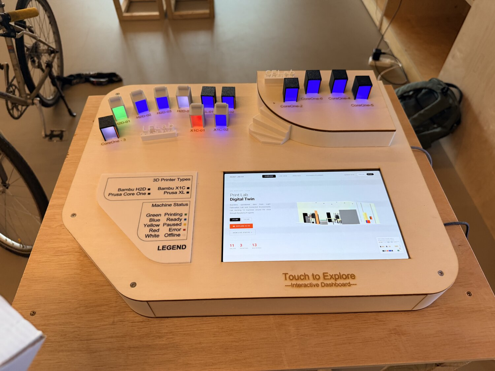
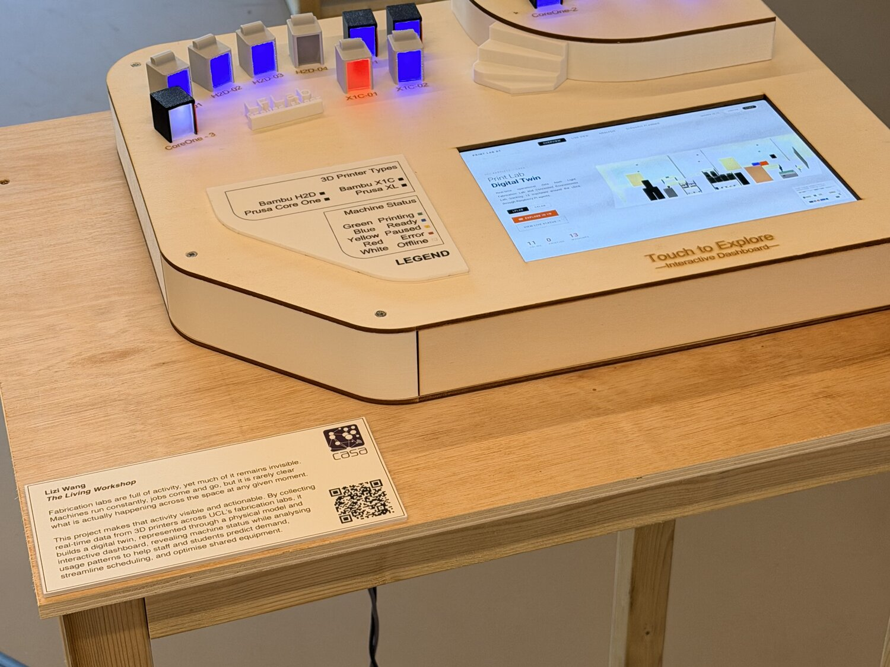
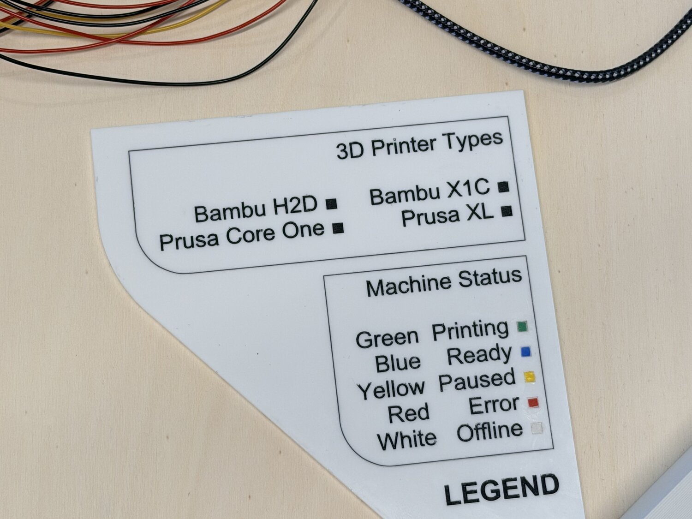
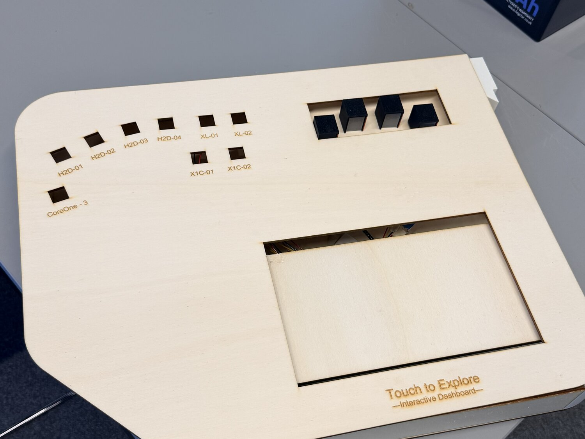
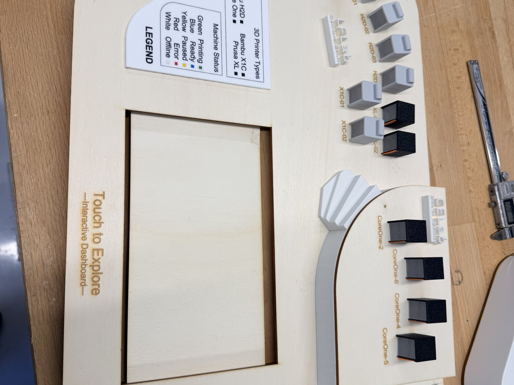
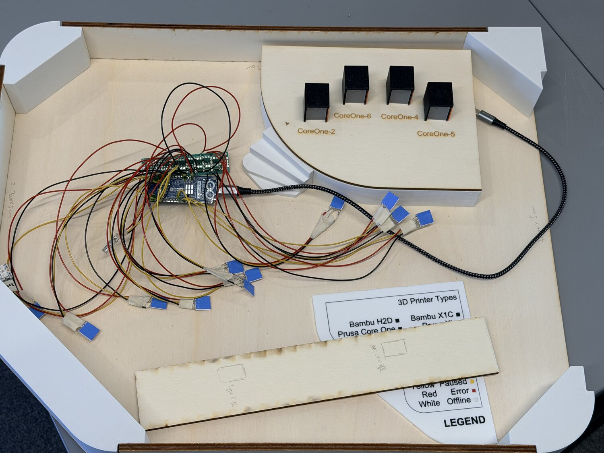

<h1 align="center">exhibit/ — The Living Workshop</h1>

<i>The physical half of the digital twin.</i>

  

> Fabrication labs are full of activity, yet much of it remains invisible. Machines run constantly, jobs come and go, but it is rarely clear what is actually happening across the space at any given moment. This project makes that activity visible and actionable: by collecting real-time data from 3D printers across UCL's fabrication labs, it builds a digital twin — a physical model plus an interactive dashboard — revealing machine status while analysing usage patterns to help staff and students predict demand, streamline scheduling, and optimise shared equipment.
>
> — *The Living Workshop*, exhibition statement

## What's here

| Folder | What it holds |
|--------|---------------|
| [`design/`](design) | Fabrication sources — 3D-printed printer miniatures, structural supports, laser-cut enclosure layers. |
| [`led-playback/`](led-playback) | The Arduino that drives the miniatures' status LEDs, and the script that bakes a month of real data into its timeline. |

Together they build the console above: a laser-cut plywood body with a tablet embedded in the middle running the live web dashboard, ringed by a 3D-printed miniature of each machine. Every miniature has two addressable LEDs that mirror that machine's real status, with a printed legend on the face.

## How the physical and digital line up

The **tablet** runs the exact same web platform as [`../dashboard/`](../dashboard) — visitors touch it to explore the Live, Analysis and Scenario Planner views. The **LEDs** speak the same status language as the dashboard, so the model tells the same story at a glance from across the room:

| LED colour | Machine status |
|---|---|
| 🟢 Green | Printing |
| 🔵 Blue | Ready / idle |
| 🟡 Amber | Paused |
| 🔴 Red | Error |
| ⚪ White | Offline |

## Gallery

**Finished, lit**

<table>
  <tr>
    <td width="50%"></td>
    <td width="50%"></td>
  </tr>
</table>

**The legend panel** — the same colour key printed on the console face

<table>
  <tr>
    <td width="50%"></td>
    <td width="50%"></td>
  </tr>
</table>

**Making it** — laser-cut body, miniatures laid out, and the wiring behind the panel (an Arduino MKR driving the NeoPixels)

<table>
  <tr>
    <td width="33%"></td>
    <td width="33%"></td>
    <td width="33%"></td>
  </tr>
</table>

## Reproducing it
See each subfolder's README: [`design/`](design) for the print/cut files and settings, [`led-playback/`](led-playback) for the hardware, wiring and how to regenerate + flash the timeline.
